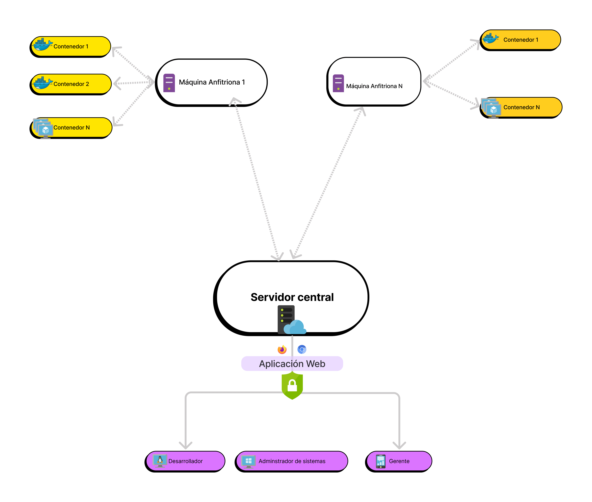

# Introducción 

Este trabajo de grado propone una aplicación web
desde la cual se pueda realizar la administración de los contenedores, así como también obtener información
general de ciertas características de los sistemas de cómputo que corren estos contenedores tales como: uso de
red, RAM, CPU, sistema operativo etc.

La plataforma consta de 2 partes:

1. Un servicio encargado de realizar toda la gestión de los contenedores en la máquina anfitriona (crear,
eliminar, editar), enviar la información del sistema y conectarse con el servidor central (Aplicación Web)
para poder realizar la gestión.

2. Una aplicación web desde la que el usuario podrá manejar a través de una interfaz gráfica cada
contenedor de la máquina anfitriona, y obtener la información del sistema y de los contenedores en
tiempo real.

Cuando definimos la gestión de contenedores el usuario podrá realizar las siguientes acciones:

- Crear contenedores a partir de imágenes públicas o usando docker compose
- Iniciar, detener y reiniciar contenedores
- Ver los registros de los contenedores
- Eliminar contenedores
- Configurar algunos parámetros de los contenedores como redes y volúmenes
- Monitorear es estado de los contenedores
- Monitorear el sistema operativo
- Ver registros de la aplicación
La siguiente figura detalla una visión general del esquema de la plataforma
